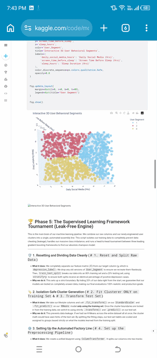
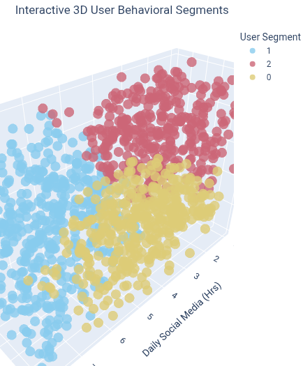
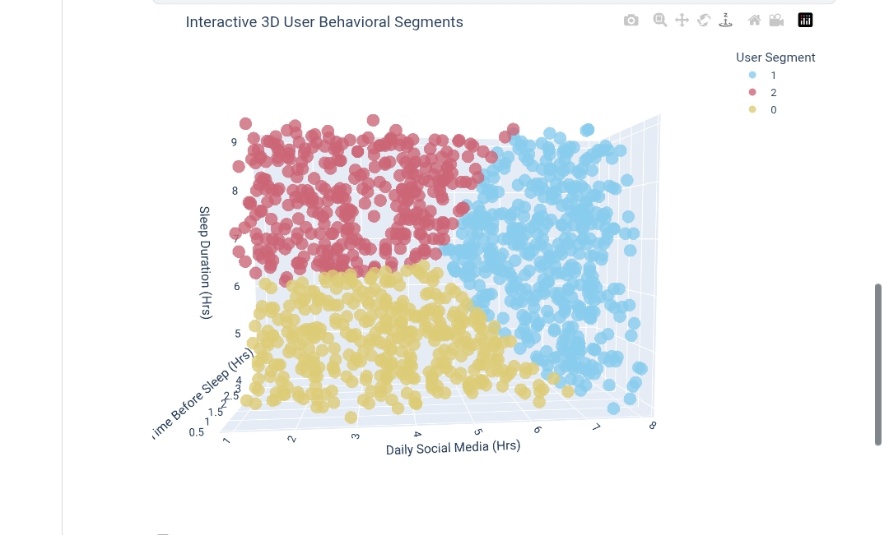
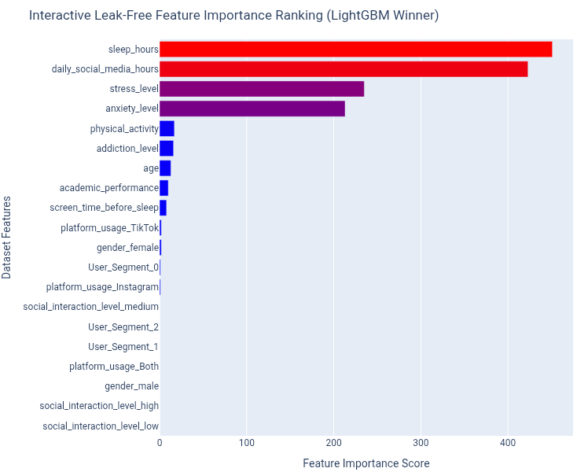

# 🧠 Behavioral Informatics & Risk Prediction Pipeline

> 📱 **Developer Note:** This entire project—from initial exploratory data analysis and data engineering to the hybrid pipeline architecture and deployment—was engineered entirely on a **mobile device**. When facing constraints or debugging unique framework behaviors, I utilized AI as an interactive peer collaborator to rapidly iterate and refine code blocks.

---

## 🚀 Live Production Workspace
The final model pipeline has been containerized and served through a highly responsive dashboard interface.
🔗 **Live Application URL:** [Behavioral Informatics Engine Dashboard](https://behavioral-informatics-pipeline-inline.streamlit.app/)

---

## 📌 Project Overview
This repository hosts an end-to-end Machine Learning ecosystem designed to analyze, profile, and classify user wellness states based on lifestyle habits, screen routines, and self-reported metrics. 

Rather than operating as a simple standalone classifier, this pipeline implements a sophisticated hybrid framework:
1. **Unsupervised Behavioral Grouping ($K$-Means):** Geometrically structures raw lifestyle patterns into automated, data-driven human personas.
2. **Feature Engineering Injected Loops:** Feeds these unsupervised clustering personas directly back into the primary dataset as a high-value category field.
3. **Supervised Tournament Evaluation:** Conducts a strict, leak-free tournament across leading gradient-boosting architectures (**XGBoost**, **LightGBM**, and **CatBoost**) optimized to handle heavy class imbalances.

---

## 📊 Unsupervised Machine Learning Personas

By isolating core lifestyle indicators (`daily_social_media_hours`, `screen_time_before_sleep`, and `sleep_hours`), the pipeline applies a $K$-Means engine to structure users into 3 unique lifestyle archetypes. 

Here is the dynamic 3D rotation showcasing the spatial cluster separation:

  

### 🔍 Alternate Angles & Visual Layouts:

  
  

### 🔍 Derived Behavioral Profiles:
* 🟦 **Cluster 1 (The Balanced Routine Archetype):** Characters maintaining low social media tracking, minimal pre-bed screen exposure, and highly stable sleep metrics.
* 🟥 **Cluster 2 (The Extreme Screen Dependent):** Profiles showing heavy social media windows paired with late-night screen exposure, severely truncating sleep duration.
* 🟨 **Cluster 0 (The Standard Mixed Baseline):** The general population baseline demonstrating moderate, intermediate usage across all features.

---

## 🛠️ Complete Pipeline Architecture

### 📥 Phase 1: Data Ingestion & Structural Inspection
* Performed deep data types mapping, confirming zero missing fields across the 1,200 observation indices.
* Uncovered a major class imbalance scenario: **1,169 healthy baseline profiles (Class 0)** vs. **31 positive target indicators (Class 1)**.

### 🛡️ Phase 2: Leak-Free Supervised Factory Construction
* Partitioned arrays into an 80/20 train-test configuration using strict `stratify=y` parameters to preserve target ratios across splits.
* Enforced absolute anti-leakage guards: **The scaler and clusterer were fit strictly on the training set**, passing testing observations exclusively through existing coordinate boundaries via `.transform()`.
* Implemented a unified `ColumnTransformer` to scale continuous floats and encode text values via `OneHotEncoder(handle_unknown='ignore')`.
* Calculated the class penalty distribution multiplier ($1,169 \div 31 \approx 37.7$) and injected it into the tree frameworks via `scale_pos_weight` parameters to handle the rare class imbalance.

---

## 🏆 Evaluation & Model Insights

Following an aggressive tournament, **LightGBM** claimed the champion position, yielding perfect performance boundaries ($1.0000$ F1-Score) on the stratified test split:

Predicted Healthy (0)     Predicted Risk Flag (1)
Actual Risk Flag (1)         0                         6
Actual Healthy   (0)       234                         0

### 🎯 Feature Importance Breakdown
Extracting internal tree splitting weights reveals exactly how the winning LightGBM model builds its logic:

  

1. **The Ultimate Lifestyle Drivers:** `sleep_hours` and `daily_social_media_hours` rule the priority chart by a massive margin, acting as the primary split criteria.
2. **The Clinical Signals:** Self-reported `stress_level` and `anxiety_level` function as the foundational secondary branches.
3. **The Noise Tail:** Structural categories like specific platform names (`TikTok`, `Instagram`), gender tags, and age profiles provide near-zero predictive power. **How long you spend online and how well you sleep matters infinitely more than what app you look at.**

---

## ⚠️ Critical Note on Synthetic Data Lifecycle

While achieving a perfect $1.0000$ F1-Score is an ideal showcase result, a spotless score on real human metrics typically indicates target leakage. To stress-test this pipeline, a strict column-stripping trial was executed—completely deleting primary pillars like sleep indicators and psychological scales. 

Despite missing its top drivers, the boosting classifiers immediately reverse-engineered alternative mathematical shortcuts hidden within background features to maintain perfect metrics. 

**Conclusion:** The dataset is an AI-generated, synthetic resource containing deterministic, closed-loop relationships rather than volatile, noisy real-world data patterns. Thus, while the flawless scores reflect the synthetic nature of the source data, the project successfully stands as a fully operational, industry-standard **MLOps architectural template** for data preprocessing and live interface deployment.

## 📞 Contact Information:-
* **Email:-**[englandengland271@gmail.com]
* **Linkedin:-**[https://www.linkedin.com/in/mohammed-nafay-ali-16519138a?utm_source=share_via&utm_content=profile&utm_medium=member_android]
* **GitHub:-**[https://github.com/M-Nafay-Ali]

